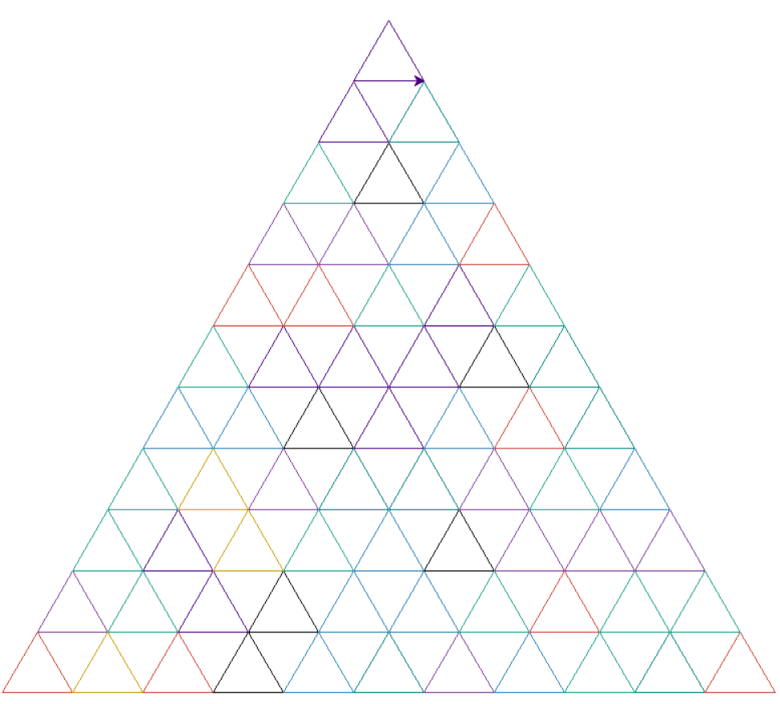

# Tugas BAO 9 Turtle Python

## Opsi yang tersedia

### Mengatur piramida

anda dapat mengatur seperti ini

```python
drawPiramida(<jumlah-segitiga-paling-bawah>, <lebar-segitiga-pixel>)
```

#### Contoh

```python
drawPiramida(11, 11)
```

Berarti akan membuat 11 segitiga sebagai dasar dengan panjang alas permasing masing 70 pixel
maka hasilnya akan seperti ini



### Mengatur Warna

Cukup hapus item atau tambahkan warna pada bagian ini

```python

colors = [
    "#C69C00",
    "black",
    "green",
    ...
]

```

### Mengatur kecepatan turtle

cukup atur dibagian ini sesuai selera

```python
t.speed(0)
```

nilai defaulnya adalah `0`
